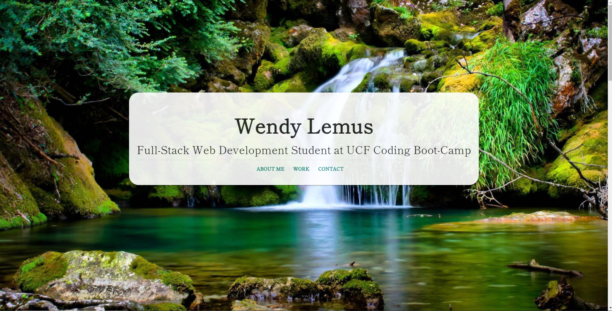

# React Portfolio

### UCF Coding Boot-Camp Module 20 Challenge

## Description

Please feel free to check out my portfolio created with HTML and CSS! It is a work in progress and I will be adding new projects as I continue my adventure in web development! 

## Table of Contents

- [Description](#Description)
- [Features](#Features)
- [Production](#Production)
- [Questions](#Questions)

 

## Features

- Navbar containes links that take user to selected section. 
- Work section display's projects with links to project repositories.
- Conact section contains links to GitHub, LinkedIn and email. 

## Production

## Questions

Please feel free to reach me for additional questions at:
 
Email: Elysiayn@gmail.com 

Visit my GitHub!
 
GitHub: [Elysiayn](https://github.com/Elysiayn)